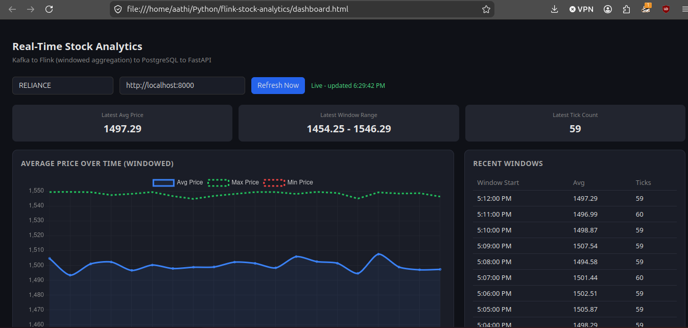

# Real-Time Stock Analytics Pipeline

A real-time streaming data pipeline built to learn **Apache Kafka** and **Apache Flink** — built for a job application requiring Flink experience, and as a hands-on way to actually understand stream processing rather than just reading about it.

**Live pipeline:** Kafka → Apache Flink (windowed aggregation) → PostgreSQL → FastAPI → Dashboard


<!-- Add a screenshot or short GIF here before publishing -->

---

## What this project does

A Python producer simulates live stock price ticks (one per second) and publishes them to a Kafka topic. Apache Flink consumes that stream, groups events into 1-minute tumbling windows, and computes average/max/min price and tick count per window. Results are written to PostgreSQL, exposed via a FastAPI endpoint, and rendered live on a dashboard that polls the API every few seconds.

```
Producer (Python) → Kafka → Apache Flink (PyFlink) → PostgreSQL → FastAPI → Dashboard (HTML/Chart.js)
```

Everything runs in Docker via `docker-compose`, including a custom Flink image with PyFlink pre-installed.

---

## Why I built this

I'm a Python/automation developer applying for roles that require Kafka and Flink experience. Rather than just reading docs, I built an end-to-end pipeline to actually hit the real problems these tools solve — and the real problems that come with running them. I'm still learning the deeper internals, but I can walk through this architecture, explain each component's job, and describe the bugs I actually debugged myself (see below).

---

## The hardest bug: watermarks and idle sources

The trickiest issue: windowed aggregations produced **zero output**, even though raw event streaming worked perfectly. It turned out Apache Flink's *watermark* — the mechanism that tracks "how caught up" the pipeline is on time — never advanced, because Flink assumed a single-partition Kafka source might still be producing late data indefinitely. The fix was adding `scan.watermark.idle-timeout` to the Kafka source config, which tells Flink to stop waiting when a partition goes quiet.

This taught me the difference between data *arriving* and a window actually *closing* — a distinction that doesn't show up until you build something real.

---

## Architecture

| Component | Role |
|---|---|
| **Kafka** | Durable, ordered message log. Producer writes price ticks; Flink reads them. |
| **Apache Flink** | Stream processing engine. Reads the Kafka stream, computes 1-minute windowed aggregations using the Table API / SQL. |
| **PostgreSQL** | Stores the aggregated results (`stock_metrics` table) via Flink's JDBC sink connector. |
| **FastAPI** | Exposes aggregated metrics as JSON (`/metrics/{symbol}`). |
| **Dashboard** | Static HTML + Chart.js page that polls the API and renders a live chart. |
| **Docker Compose** | Runs Kafka, Flink JobManager, Flink TaskManager, and Postgres as isolated services on a shared network. |

---

## Project structure

```
app/
├── producer/producer.py        # Generates simulated stock price events → Kafka
├── common/kafka_client.py      # Shared Kafka connection config
├── flink_job/
│   ├── sources/kafka_source.py # Kafka → Flink table definition + watermark strategy
│   ├── sinks/postgres_sink.py  # Flink → Postgres JDBC sink definition
│   ├── sinks/console_sink.py   # Debug sink (prints to console instead of DB)
│   └── jobs/stock_job.py       # Main pipeline: source → windowed aggregation → sink
└── api/main.py                 # FastAPI endpoint exposing aggregated metrics

docker-compose.yml               # Kafka, Flink JobManager/TaskManager, Postgres
docker/flink.Dockerfile          # Custom Flink image with Python + PyFlink baked in
flink-jars/                      # Kafka, JSON, and JDBC connector JARs
dashboard.html                   # Live dashboard (Chart.js)
```

---

## Running it locally

**Requirements:** Docker, Docker Compose, Python 3.12, a Kafka JDBC/connector JAR set (see `flink-jars/`)

```bash
# 1. Bring up Kafka, Flink, and Postgres
docker compose up -d

# 2. Create the Postgres table
docker exec -it postgres psql -U stockuser -d stockdb -c "
CREATE TABLE stock_metrics (
    symbol VARCHAR(20),
    window_start TIMESTAMP,
    window_end TIMESTAMP,
    avg_price DOUBLE PRECISION,
    max_price DOUBLE PRECISION,
    min_price DOUBLE PRECISION,
    tick_count BIGINT,
    PRIMARY KEY (symbol, window_start)
);"

# 3. Start the producer (Terminal 1)
python -m app.producer.producer

# 4. Run the Flink job (Terminal 2)
docker exec -it jobmanager bash
cd /opt/flink/project
python3 -m app.flink_job.jobs.stock_job

# 5. Start the API (Terminal 3)
uvicorn app.api.main:app --reload --port 8000

# 6. Open dashboard.html in a browser
```

---

## What I'd improve next

- Multi-symbol support (currently hardcoded to one stock)
- Proper alerting/monitoring instead of manual log-checking
- Exactly-once processing guarantees (currently at-least-once via Kafka defaults)
- CI/CD for the Docker build
- Unit tests for the Flink SQL logic

---

## Tech stack

Python · Apache Kafka · Apache Flink (PyFlink) · PostgreSQL · FastAPI · Docker · Chart.js
